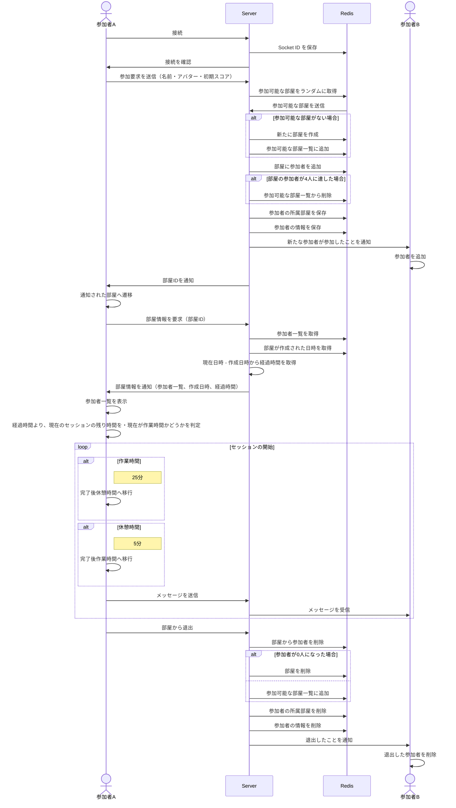

# シーケンス図

```mermaid
sequenceDiagram
  actor 参加者A
  participant 参加者A
  participant Server
  participant Redis
  actor 参加者B

  参加者A ->> Server: 接続
  Server ->> Redis: Socket ID を保存
  Server ->> 参加者A: 接続を確認
  参加者A ->> Server: 参加要求を送信（名前・アバター・初期スコア）
  Server ->> Redis: 参加可能な部屋をランダムに取得
  Redis ->> Server: 参加可能な部屋を送信
  alt 参加可能な部屋がない場合
    Server ->> Redis: 新たに部屋を作成
    Server ->> Redis: 参加可能な部屋一覧に追加
  end
  Server ->> Redis: 部屋に参加者を追加
  alt 部屋の参加者が4人に達した場合
    Server ->> Redis: 参加可能な部屋一覧から削除
  end
  Server ->> Redis: 参加者の所属部屋を保存
  Server ->> Redis: 参加者の情報を保存
  Server ->> 参加者B: 新たな参加者が参加したことを通知
  参加者B ->> 参加者B: 参加者を追加
  Server ->> 参加者A: 部屋IDを通知
  参加者A ->> 参加者A: 通知された部屋へ遷移
  参加者A ->> Server: 部屋情報を要求（部屋ID）
  Server ->> Redis: 参加者一覧を取得
  Server ->> Redis: 部屋が作成された日時を取得
  Server ->> Server: 現在日時 - 作成日時から経過時間を取得
  Server ->> 参加者A: 部屋情報を通知（参加者一覧、作成日時、経過時間）
  参加者A ->> 参加者A: 参加者一覧を表示
  参加者A ->> 参加者A: 経過時間より、現在のセッションの残り時間を・現在が作業時間かどうかを判定
  loop セッションの開始
    alt 作業時間
      Note right of 参加者A: 25分
      参加者A ->> 参加者A: 完了後休憩時間へ移行
    end
    alt 休憩時間
      Note right of 参加者A: 5分
      参加者A ->> 参加者A: 完了後作業時間へ移行
    end
    参加者A ->> Server: メッセージを送信
    Server ->> 参加者B: メッセージを受信
  end
  参加者A ->> Server: 部屋から退出
  Server ->> Redis: 部屋から参加者を削除
  alt 参加者が0人になった場合
    Server ->> Redis: 部屋を削除
  else
    Server ->> Redis: 参加可能な部屋一覧に追加
  end
  Server ->> Redis: 参加者の所属部屋を削除
  Server ->> Redis: 参加者の情報を削除
  Server ->> 参加者B: 退出したことを通知
  参加者B ->> 参加者B: 退出した参加者を削除
```
